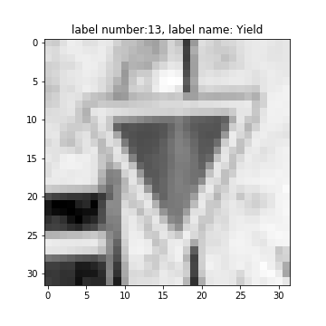
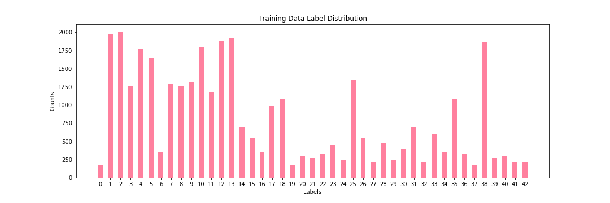
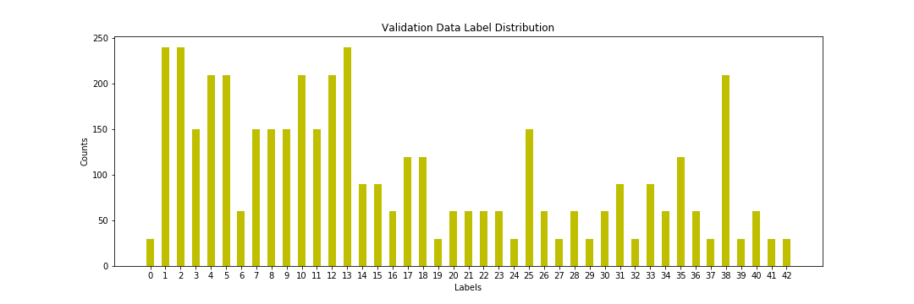
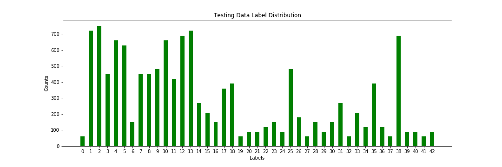
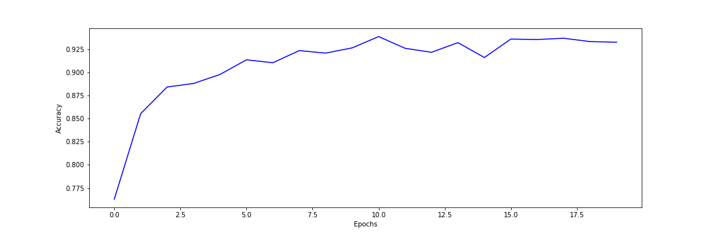

# **Traffic Sign Recognition** 

**Build a Traffic Sign Recognition Project**

The goals / steps of this project are the following:

* Load the data set (see below for links to the project data set)
* Explore, summarize and visualize the data set
* Design, train and test a model architecture
* Use the model to make predictions on new images
* Analyze the softmax probabilities of the new images
* Summarize the results with a written report

### Data Set Summary & Exploration

####1. Provide a basic summary of the data set and identify where in your code the summary was done. In the code, the analysis should be done using python, numpy and/or pandas methods rather than hardcoding results manually.

The code for this step is contained in the second code cell of the IPython notebook.  

I used the pandas library to calculate summary statistics of the traffic
signs data set:

* The size of training set is 34799
* The size of test set is 12630
* The shape of a traffic sign image is (32, 32, 3)
* The number of unique classes/labels in the data set is 43

####2. Include an exploratory visualization of the dataset and identify where the code is in your code file.

The code for this step is contained in the third code cell of the IPython notebook.  

Here is an exploratory visualization of the data set. It is a bar chart showing the data size is 32 by 32 and the label number and the corresponding label name.

###Design and Test a Model Architecture

####1. Describe how, and identify where in your code, you preprocessed the image data. What tecniques were chosen and why did you choose these techniques? Consider including images showing the output of each preprocessing technique. Pre-processing refers to techniques such as converting to grayscale, normalization, etc.

The code for this step is contained in the fourth code cell of the IPython notebook.
Here is the image we have before preprocessing:

As a first step, I decided to convert the images to grayscale because grayscale image have

Here is an example of a traffic sign image before and after grayscaling.

As a last step, I normalized the image data because ...

####2. Describe how, and identify where in your code, you set up training, validation and testing data. How much data was in each set? Explain what techniques were used to split the data into these sets. (OPTIONAL: As described in the "Stand Out Suggestions" part of the rubric, if you generated additional data for training, describe why you decided to generate additional data, how you generated the data, identify where in your code, and provide example images of the additional data)

The code for splitting the data into training and validation sets is contained in the fifth code cell of the IPython notebook.  

To cross validate my model, as the distribution chart I showed here, the validation data set have the same distribution of training set and the data ratio is 10: 1(train : valid)

Here are the distribution of the training dataset, validation dataset and testing dataset:

The testing dataset is the leave out data which is used for the finalized data model.

####3. Describe, and identify where in your code, what your final model architecture looks like including model type, layers, layer sizes, connectivity, etc.) Consider including a diagram and/or table describing the final model.

The code for my final model is located in the seventh cell of the ipython notebook. 

My final model consisted of the following layers:

| Layer         		|     Description	        					| 
|:---------------------:|:---------------------------------------------:| 
| Input         		| 32x32x1 grayscaled image   							| 
| Convolution 3x3     	| 1x1 stride, valid padding, outputs 30x30x10 	|
| RELU					|												|
| Max pooling	      	| 2x2 stride,  outputs 15x15x10				|
| Convolution 5x5	    | 1x1 stride, valid padding, outputs 10x10x24       									|
| Max pooling	      	| 2x2 stride,  outputs 5x5x24
| Flattening 		| 600      									|
| Fully connected		| 150      									|
| Fully connected		| 84     									|
| logits		| 43     									|
| Softmax				|         									|
|	AdaOptimizer					|												|

 

####4. Describe how, and identify where in your code, you trained your model. The discussion can include the type of optimizer, the batch size, number of epochs and any hyperparameters such as learning rate.

The code for training the model is located in the eigth cell of the ipython notebook. 

* batch size: 128
* epochs: 20
* learning rate: 0.001

####5. Describe the approach taken for finding a solution. Include in the discussion the results on the training, validation and test sets and where in the code these were calculated. Your approach may have been an iterative process, in which case, outline the steps you took to get to the final solution and why you chose those steps. Perhaps your solution involved an already well known implementation or architecture. In this case, discuss why you think the architecture is suitable for the current problem.

The code for calculating the accuracy of the model is located in the ninth cell of the Ipython notebook.

My final model results were:

 **test set accuracy** of 0.913

If an iterative approach was chosen:

* What was the first architecture that was tried and why was it chosen?
	Initial architecture: LeNet. 
* What were some problems with the initial architecture?
   LeNet is used to deal with some letter data, the lines and shapes it can deal with is limited by the hyperplane. 
* How was the architecture adjusted and why was it adjusted? Typical adjustments could include choosing a different model architecture, adding or taking away layers (pooling, dropout, convolution, etc), using an activation function or changing the activation function. One common justification for adjusting an architecture would be due to over fitting or under fitting. A high accuracy on the training set but low accuracy on the validation set indicates over fitting; a low accuracy on both sets indicates under fitting.
  Increased the hyperplane depth. 
* Which parameters were tuned? How were they adjusted and why?
  Increased the hyperplane depth. So the feature maps can detect more features.
* What are some of the important design choices and why were they chosen? For example, why might a convolution layer work well with this problem? How might a dropout layer help with creating a successful model?
	Tried to use the dropout layer between the fully connected layers. But that'll cause the percision drop. The reason for that I think is caused by the dropout layer will miss some data info with 0.5 keeping rate. Will try to increase the keeping rate and see if that helps.

If a well known architecture was chosen:

* What architecture was chosen? 
	I'll try to use inception model to train this data set.
* Why did you believe it would be relevant to the traffic sign application?
	Cause this model actually combine the all the model we want and choose the best for later use. This'll inccrease the accuracy.

 

###Test a Model on New Images

####1. Choose five German traffic signs found on the web and provide them in the report. For each image, discuss what quality or qualities might be difficult to classify.

Here are five German traffic signs that I found on the web:

####2. Discuss the model's predictions on these new traffic signs and compare the results to predicting on the test set. Identify where in your code predictions were made. At a minimum, discuss what the predictions were, the accuracy on these new predictions, and compare the accuracy to the accuracy on the test set (OPTIONAL: Discuss the results in more detail as described in the "Stand Out Suggestions" part of the rubric).

The code for making predictions on my final model is located in the tenth cell of the Ipython notebook.

Here are the results of the prediction:
Image: ./images/do-not-enter.png, prediction result: Priority road
Image: ./images/keepright.png, prediction result: Roundabout mandatory
Image: ./images/speedlimit-30.png, prediction result: Roundabout mandatory
Image: ./images/stop.png, prediction result: Stop
Image: ./images/yield.png, prediction result: Yield

| Image			        |     Prediction	        					| 
|:---------------------:|:---------------------------------------------:| 
| Stop Sign      		| Stop sign   									| 
| Keep Right    			| Roundabout mandatory 										|
| Yield					| Yield											|
| 30 km/h	      		| Roundabout mandatory					 				|
| Do not enter			| Priority road      							|

The model was able to correctly guess 2 of the 5 traffic signs, which gives an accuracy of 40%. This compares favorably to the accuracy on the test set of 91%

And the factors that might affect the classification difficulties are:
1. The angle of the traffic sign. For example the Speedlimit 30 one and Yield traffic sign.
2. The training data not contains enough data for some traffic sign. So training the data for 20 epoches may overfit the data.
3. The picture contrast may also an effect for that. Normalization of the pictures may need further improvement.

####3. Describe how certain the model is when predicting on each of the five new images by looking at the softmax probabilities for each prediction and identify where in your code softmax probabilities were outputted. Provide the top 5 softmax probabilities for each image along with the sign type of each probability. (OPTIONAL: as described in the "Stand Out Suggestions" part of the rubric, visualizations can also be provided such as bar charts)

The code for making predictions on my final model is located in the 11th cell of the Ipython notebook.

Here are the top 5 possibilities for 5 images:

* Actual image: No entry
Priority road: 97.919%
Stop: 1.553%
Ahead only: 0.509%
Turn left ahead: 0.010%
Yield: 0.009%

* Actual image: Keep Right
Roundabout mandatory: 51.798%
No entry: 40.148%
No passing for vehicles over 3.5 metric tons: 7.343%
Dangerous curve to the right: 0.652%
End of no passing: 0.051%

* Actual image: 30 km/h
Roundabout mandatory: 48.646%
Go straight or left: 37.448%
Road work: 10.688%
Turn right ahead: 1.108%
Bicycles crossing: 0.635%

* Actual image: Stop sign
Stop: 99.985%
No entry: 0.013%
Turn right ahead: 0.001%
Priority road: 0.001%
Speed limit (70km/h): 0.000%

* Actual image: Yield
Yield: 100.000%
Priority road: 0.000%
No vehicles: 0.000%
Ahead only: 0.000%
Stop: 0.000%