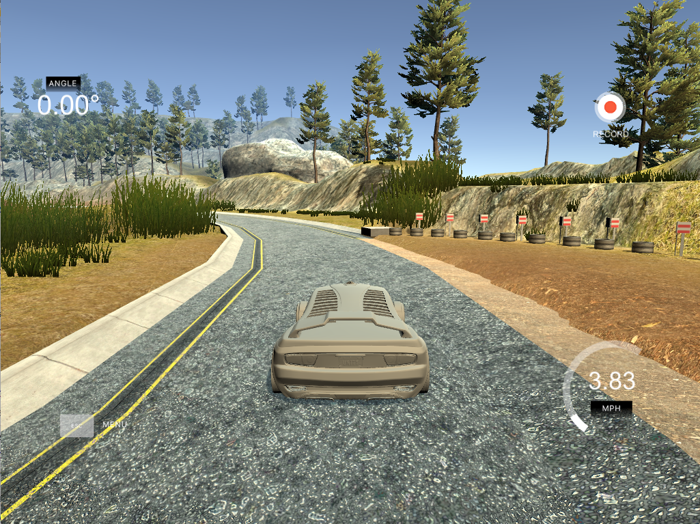
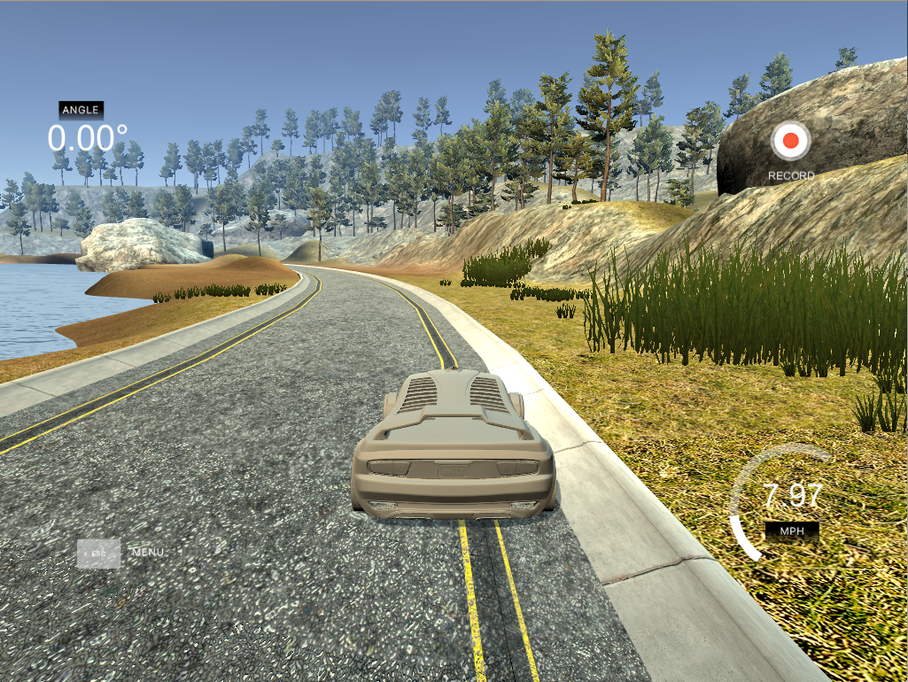
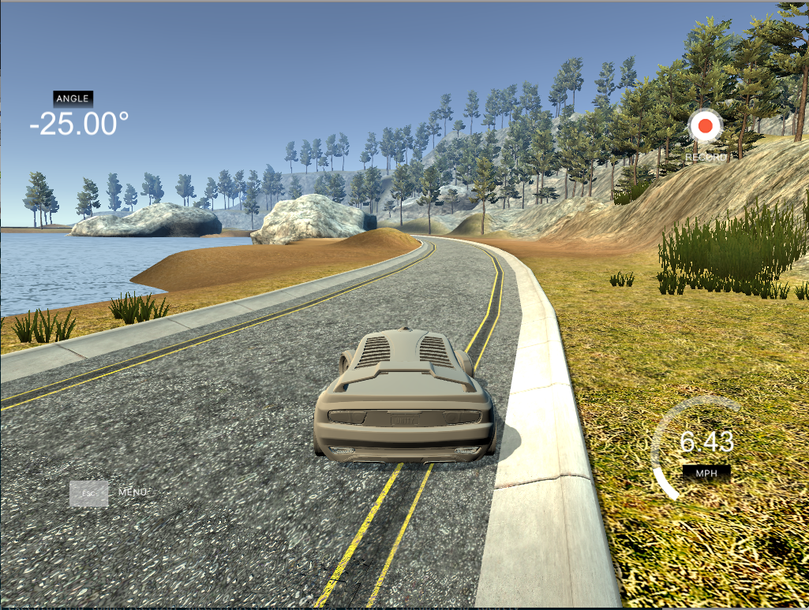
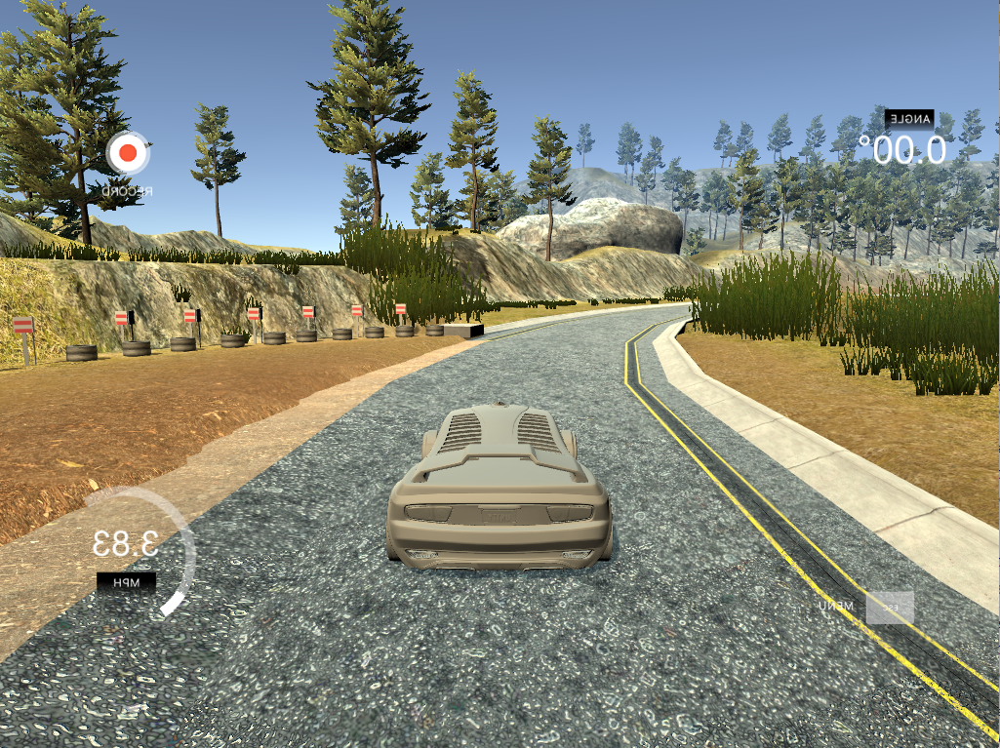

# **Behavioral Cloning** 

**Behavioral Cloning Project**

The goals / steps of this project are the following:

* Use the simulator to collect data of good driving behavior
* Build, a convolution neural network in Keras that predicts steering angles from images
* Train and validate the model with a training and validation set
* Test that the model successfully drives around track one without leaving the road

### Files Submitted & Code Quality

#### 1. Submission includes all required files and can be used to run the simulator in autonomous mode

My project includes the following files:

* model.py containing the script to create and train the model. It contains all the logic for convolution neural network in Keras
* drive.py for driving the car in autonomous mode
* model.h5 containing a trained convolution neural network 
* writeup_report.md summarizing the results

#### 2. Submission includes functional code
Using the Udacity provided simulator and my drive.py file, the car can be driven autonomously around the track by executing 
```sh
python drive.py model.h5
```

#### 3. Submission code is usable and readable

The model.py file contains the code for training and saving the convolution neural network. The file shows the pipeline I used for training and validating the model. To execute the code in the folder with drive_log.csv and IMG folder

```sh
python model.py --augmentation True --include_counter_clock True
```

### Model Architecture and Training Strategy

#### 1. An appropriate model architecture has been employed and here is the final model used:

My final model consisted of the following layers in model.py line 111-131:

| Layer         		|     Description	        					| 
|:---------------------:|:---------------------------------------------:| 
| Input         		| 160x320x3 image   							| 
| Lambda         		| normalize image: x/255.0-0.5  							|
| Cropping2D         		| crop image top and bottom part 							|
| Convolution 5x5     	| filter size of 5x5x(24) and stride 2x2, Activation function use: RELU|
| Convolution 5x5     	| filter size of 5x5x(36) and stride 2x2, Activation function use: RELU |
| Convolution 5x5     	| filter size of 5x5x(48) and stride 2x2, Activation function use: RELU |
| Convolution 3x3     	| filter size of 5x5x(64) and stride 1x1, Activation function use: RELU |
| Convolution 3x3     	| filter size of 5x5x(64) and stride 1x1, Activation function use: RELU |
| Flattening 		|      									|
| Fully connected		| 100      									|
| Fully connected		| 50    									|
| Fully connected		| 10    									|
| Fully connected		| 1    									|

The model includes RELU layers to introduce nonlinearity, and the data is normalized in the model using a Keras lambda layer and removed some notice information by crop the top and bottom of each image. 

#### 2. Attempts to reduce overfitting in the model

The model was trained and validated on different data sets to ensure that the model was not overfitting (code line 148). The model was tested by running it through the simulator and ensuring that the vehicle could stay on the track.

#### 3. Model parameter tuning

The model used an adam optimizer, so the learning rate was not tuned manually (model.py line 154).

#### 4. Appropriate training data

Training data was chosen to keep the vehicle driving on the road. I used a combination of center lane driving, recovering from the left and right sides of the road use correction factor 0.15(model.py line 61-68)

For details about how I created the training data, see the next section. 

### Model Architecture and Training Strategy

#### 1. Solution Design Approach

The overall strategy for deriving a model architecture was to use keras to build a neural network with data preprocessed with lambda layer and cropping layer. The details about the layers design check next section.

My first step was to use a convolution neural network model similar to the nividia net. I thought this model might be appropriate because this nividia net is created by nividia for self driving car model. 

In order to gauge how well the model was working, I split my image and steering angle data into a training and validation set(model.py line 148). I found that my model had a mean squared error(mse) on the training set which almost the same with the mean square error on the validation set. So it means my model is not overfitted. And try to use 10 epoches to train the data, but the mse are not dropping in last 3 epoches. 

To combat the overfitting, I modified the epoches number to be 5 so each epoche will have mse drop in both training set and validation set. 

The final step was to run the simulator to see how well the car was driving around track one. There were a few spots where the vehicle fell off the track. And the vehicle is all the way to the right of the track. To improve the driving behavior in these cases, to deal with this unbalanced data issue. I collected the counter-clockwised data and add dataset to the overall samples.

At the end of the process, the vehicle is able to drive autonomously around the track without leaving the road.

#### 2. Creation of the Training Set & Training Process

To capture good driving behavior, I first recorded two laps on track one using center lane driving. Here is an example image of center lane driving:



I then recorded the vehicle recovering from the left side and right sides of the road back to center so that the vehicle would learn to recover from the track side to the center. These images show what a recovery looks like:




Then I repeated this process on track two in order to get more data points.

To augment the data set, I also flipped images and angles thinking that this would make the data be balanced. For example, here is an image that has then been flipped:



Also collected a data set by drive counter-clockwised. This also make the data to be more balanced.

After the collection process, I had 27054 number of data points. I then preprocessed this data by normalize the data with formula: x/255.0-0.5. And Cropping the bottom and top of each image, so the data noise will be removed.

I finally randomly shuffled the data set and put 20% of the data into a validation set. And use a generator to generate batchs(model.py line 42-57).

I used this training data for training the model. The validation set helped determine if the model was over or under fitting(use fit_generation, model.py line160-162). The ideal number of epochs was 5. I used an adam optimizer so that manually training the learning rate wasn't necessary.
